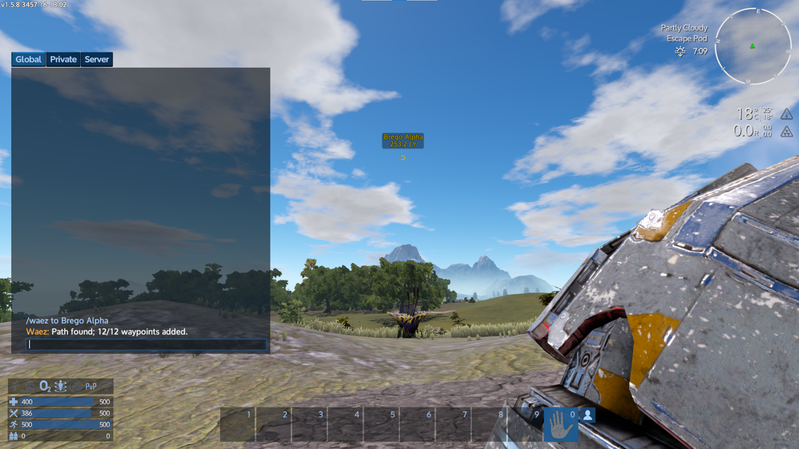

### Installation
- Get the most recent .zip (version 0.6 at time of writing) from 
  https://github.com/shudson6/EGS-GalacticWaez/releases
- Unzip it to your [Empyrion]\Content\Mods directory.

### Usage
##### Single-Player
Upon loading your game, Waez will begin setting up its galaxy map. This may take from a few seconds 
to over a minute, depending on the size of your galaxy. Once finished, you will see a message
window, "Waez is Ready."

To plot a course, first place a marker on the star you want to go to[^1]. Then, enter
`/waez to [yourmarkername]` in the chat window. The mod will respond saying either it found a path
and added waypoints or that there was an error.

### Commands
To send a command, enter `/waez ` in chat followed by a command:

`bookmarks [clear|hide|show]` remove Waez_ bookmarks or hide/show them in HUD (requires exit/resume)
[^2]
  - `clear` removes all Waez_ map markers belonging to the player.
  - `hide` unchecks "Show on HUD" for all Waez_ map markers belonging to the player.
  - `show` checks "Show on HUD" for all Waez_ map markers belonging to the player.

`clear` shorthand for `bookmarks clear`

`ginfo` displays information about the galaxy map. See [Troubleshooting](#Troubleshooting) for more.

`help` displays help

`pinfo` displays information about the player. Alternatively,  
`pinfo [playerId]` displays information about a specific player. Note that this command is intended
  for troubleshooting/debugging, and the range value displayed may not be accurate.

`restart [source]` reinitializes waez. Source can be:
  - `file-only` loads map data from the save game, if available
  - `scan-only` scans memory for star data
  - `normal` loads from save game if available, otherwise scans memory
  See [Troubleshooting](#Troubleshooting) for more.

`status` get the present status: Uninitialized, Initializing, InitFailed, or Ready. Status must be
  Ready to use navigation.

`store` writes galaxy data to the savegame. See [Troubleshooting](#Troubleshooting).

`to [mapmarker]` plot a course to [mapmarker] and add mapmarkers for each step.  
`to --range=XX [mapmarker]` plots a course, using the specified jump range instead of the one
  calculated by Waez. Useful for example when the range given by `pinfo` is incorrect.
  `XX` is given in LY.

### Troubleshooting

It's possible that Waez will not find all of the stars, resulting in an incomplete galaxy map that
just won't do. To check for this condition, you can enter the console command `galaxy info` to find
out how many stars are in the galaxy. Then enter `/waez ginfo` in chat to find out how many stars
the mod thinks there are. If Waez is wrong, run `/waez restart scan-only` to retry scanning memory
for the map data. When the status (`/waez status`) is Ready again, `/waez ginfo` again to make sure.
Sometimes it may be necessary to wait a minute or, rarely, to exit and reload before this will work.
Once Waez has found all the stars, do `/waez store --replace` to overwrite any saved map data and
ensure correct starts going forward.

For what it's worth, as of version 0.6, the author has only seen this issue with the dedicated
server mod, which is not considered ready anyway :)

### Footnotes

[^1]: This is necessary because undiscovered stars cannot be referenced by name. If you have visited
the star already, you can skip this step and call the star by its name.

[^2]: When Waez changes map markers (add, remove, or edit), the changes do not appear on the HUD.
You can verify the changes by looking at the Galaxy Map, but the only known way (at time of writing)
to refresh them on the HUD is to exit and reenter the game.
